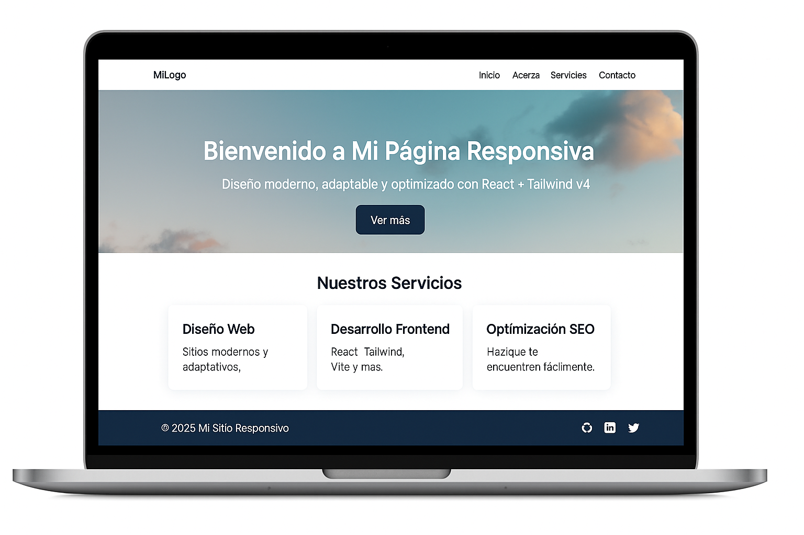

# 🌐 Página Responsiva con React + Tailwind CSS v4



Este proyecto es una **landing page moderna, animada y completamente responsiva**, desarrollada con **React + Vite** y **Tailwind CSS v4**.  
Incluye un **hero con fondo parallax**, una sección de **servicios**, un **formulario de contacto interactivo** y un **footer profesional con redes sociales**.

---

## 🚀 Tecnologías utilizadas

- ⚛️ **React 18**
- ⚡ **Vite**
- 🎨 **Tailwind CSS v4**
- 💾 **Font Awesome 6.5.0** (CDN para íconos sociales)
- 🧠 **Intersection Observer API** (animaciones al hacer scroll)

---

## 📁 Estructura del proyecto

```
pagina-responsiva/
├── index.html
├── package.json
├── src/
│   ├── main.jsx
│   ├── index.css
│   ├── App.jsx
│   ├── components/
│   │   ├── Navbar.jsx
│   │   ├── Hero.jsx
│   │   └── Card.jsx
│   └── pages/
│       ├── Home.jsx
│       └── Contact.jsx
└── public/
    └── favicon.png
```

---

## 🧠 Características principales

✅ **Diseño 100 % responsivo**  
Adaptado para móvil, tablet y escritorio con grid y flexbox.  

✅ **Hero moderno con efecto parallax**  
Texto central animado, imagen de fondo y degradado.  

✅ **Sección de servicios animada**  
Tarjetas con animación `fadeInUp` y efectos hover suaves.  

✅ **Formulario de contacto funcional**  
Interfaz clara, validación de campos y animación al aparecer.  

✅ **Footer interactivo**  
Gradiente animado con íconos de redes (GitHub, LinkedIn, X).  

---

## ⚙️ Instalación y ejecución

1️⃣ Clona este repositorio:

```bash
git clone https://github.com/tu-usuario/pagina-responsiva.git
cd pagina-responsiva
```

2️⃣ Instala las dependencias:

```bash
npm install
```

3️⃣ Inicia el servidor de desarrollo:

```bash
npm run dev
```

4️⃣ Abre el proyecto en tu navegador en:

👉 [http://localhost:5173](http://localhost:5173)

---

## 🖌️ Personalización

Puedes personalizar fácilmente:

- 🌈 **Colores** y **degradados** en `index.css` o dentro de los componentes.  
- ✏️ **Textos** y **contenido** en los archivos `Hero.jsx`, `Home.jsx` y `Contact.jsx`.  
- 🌍 **Enlaces de redes sociales** en el `footer` dentro de `App.jsx`.  

---

## ☁️ Despliegue

Este proyecto es totalmente compatible con plataformas como:

- **Vercel**
- **Netlify**
- **Render**

Solo realiza un *push* del repositorio y el sistema detectará automáticamente el build de Vite.

---

## 👨‍💻 Autor

**Pablo Raúl Arreola Contreras**  
📚 Estudiante de Desarrollo Web — Universidad Mariano Gálvez de Guatemala  
🎓 Carné: *1790-21-18516*  
📧 *pablo.arreola@example.com*

---

## 🪄 Licencia

Este proyecto se distribuye con fines educativos y puede modificarse libremente.
